## CI/CD en Oracle Kubernetes Engine Utilizando Jenkins

La finalidad de este demo es configurar Jenkins para realizar deploymente de una aplicaicón en Oracle Kubernetes Engine (OKE)

### Requerimientos:

- Cuenta de Oracle Cloud Infrastructure(test gratuito https://www.oracle.com/cloud/free/)
- Putty ssh, o cualquier cliente ssh que se utilice (Validar versión de sistema operativo y descargar https://www.chiark.greenend.org.uk/~sgtatham/putty/latest.html)
- Cuenta de Github (https://github.com/signup?ref_cta=Sign+up&ref_loc=header+logged+out&ref_page=%2F&source=header-home)

### Aclaraciones:
- XXXXXX Corresponde a varibale que debe ser modificada en base a la que cada uno posee
- 

### ¿Qué vamos a hacer?

- Instalar/Configurar OKE
- Instalar y Configurar Jenkins
- Instalación Helm
- Clonar repositorio Github
- Despliegue de aplicación
	- Descargar imágen desde dockerhub
	- Crear imágen personalizada de contenedor (compilar)
	- Subirla a OCI registry
	- Instalar app desde Helm
	- Despliegue en Kubernetes
- Modificar aplicación
- Despliegue automático 

### Paso a Paso OKE
**Crear Compartment**

Menú -> Identity & Security -> Compartmente -> New Compartment

	CAMPO				VALOR
	==============================================
	Name		 		OKE
	Description 			OKE
	Parent Compartment 		XXXX (root)

**Creación de VCN**

Menú > Networking > Virtual Cloud Network > Start VCN Wizard > Start VCN Wizard
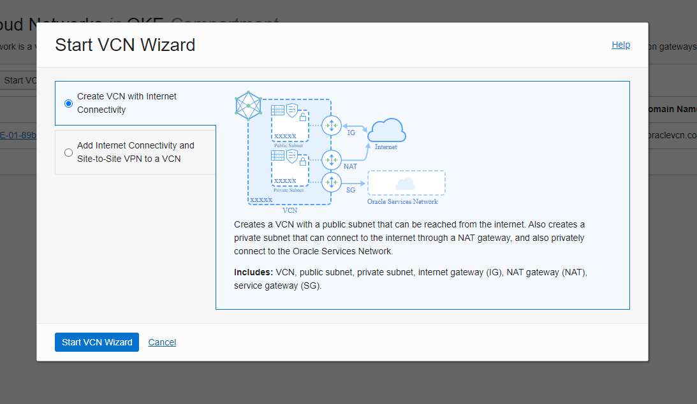

Dentro de la configuración definir
	
	VNC Name:			VNC-OKE
	Compartment:			OKE
	
Click en Next
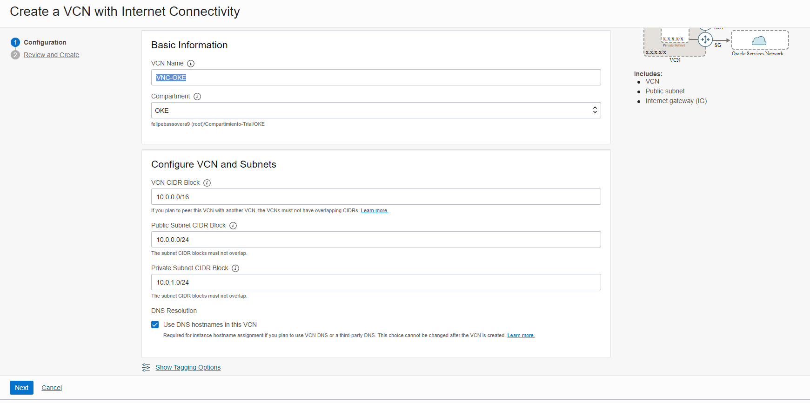

Validar Resumen y hacer click en Create
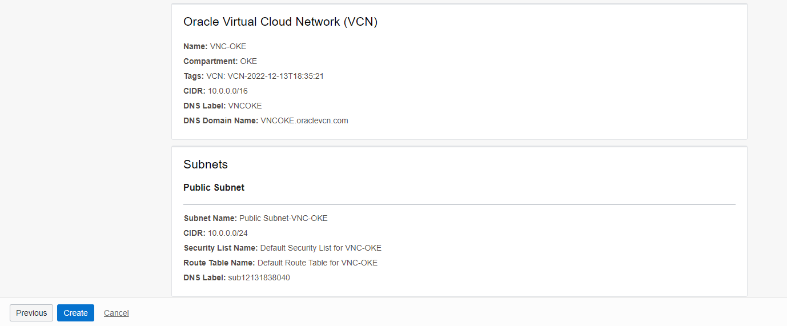

**Crear cluster OKE, dentro del compartment OKE y nombrarlo cluster1**

Menú -> Developer Services -> Kubernetes Clusters (OKE)
**IMPORTATE: validar que todo se cree en compartment OKE**

	
Create Cluster -> Quick Create 

**El proceso de creación del cluster de OKE tarda aproximadamente 20 minutos. durante este periodo, crear el servidor virtual de Jenkins**

Menú > Compute > Instances > Create Instance
Dentro de esta configuración se debe definir
	
	Name:				jenkins
	Create in compartment:		OKE
	Availability domain:		El que esté disponible
	Image and shape, Image:		Oracle Linux 8
	Shape:				VM.Standard.E4.Flex

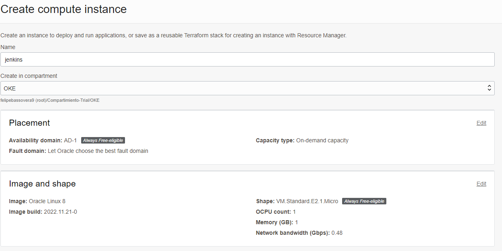

	Virtual cloud network in OKE:	VNC-OKE
	Subnet in OKE:			Public Subnet-VNC-OKE (regional)
	Public IPv4 address:		Assign a public IPv4 address

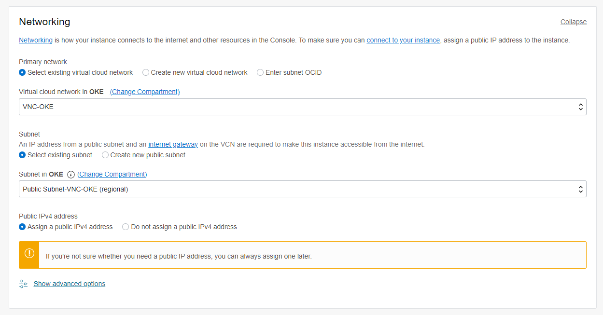

**IMPORTANTE: SIN ESTE PUNTO NO TENRÁN ACCESO AL SERVIDOR JENKINS POR SSH**

	Add SSH keys:			Generate a key pair for me
	Hacer click en Save private key y en Save public key y guardarlas en un directorio conocido, se utilizarán después

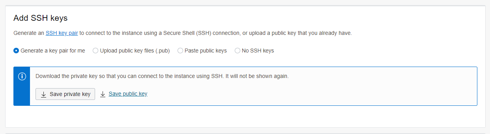

	Finalmente, click en Create
		
Una vez que el servidor Jenkins esté creado, copiar la ip pública

**Configurar la llave privada para ser compatible con putty**

	Abrir el programa "puttyGen" > Conversions > Import Key

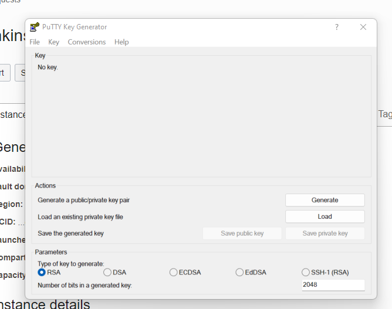

	Cargar la llave privada y click en "Save private key" sin passhrase, click en "Yes"

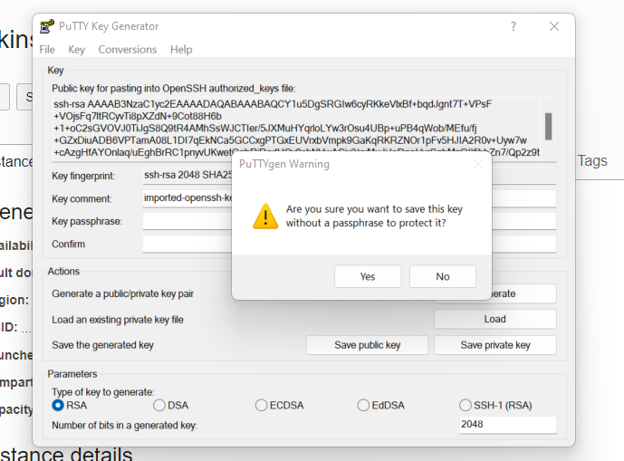

	Almacenarla con el nombre "private.ppk", finalmente cerrar puttyGen

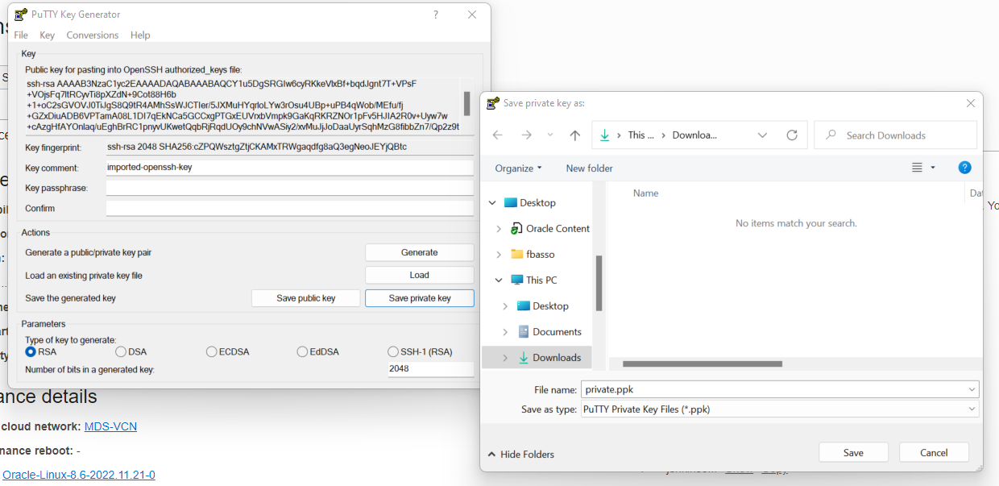

**Abrir y configurar Putty para que use la llave ssh creada y descargada desde OCI**

	Abrir putty y en el campo "Host Name (or IP address)" pegar la ip pública del servidor Jenkins creado
	

Para realizar la conexión, se debe cargar el certificado privado ssh recientemente creado 
	En el menú izquierdo ir a Connection > + SSH > Auth > Browse...

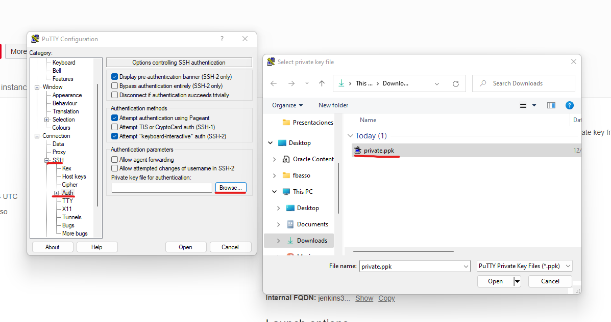

Finalmente realizar la conexión haciendo click en "Open"

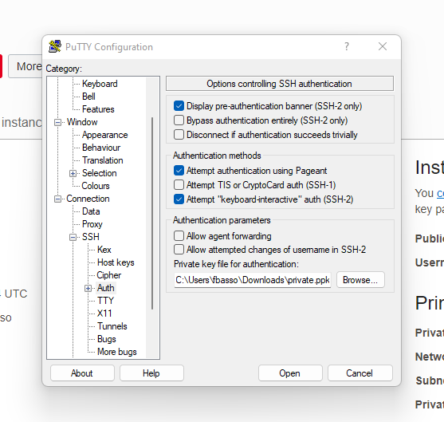

Cuando se abra la consola aceptar el certificado click en "Accept" y realizar login con el usuario "opc"
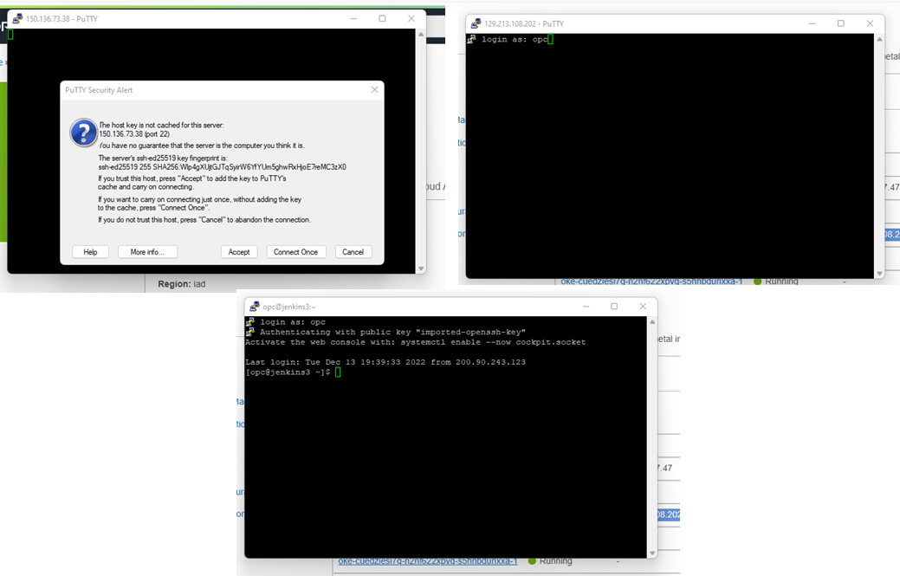

**Instalación de paquetes Jenkins**

	$ sudo yum upgrade -y
	$ sudo yum install java -y
	$ sudo wget -O /etc/yum.repos.d/jenkins.repo http://pkg.jenkins-ci.org/redhat/jenkins.repo
	$ sudo rpm --import https://jenkins-ci.org/redhat/jenkins-ci.org.key
	$ sudo yum install jenkins -y
	$ sudo systemctl enable --now jenkins

**Abrir los puertos de firewall**

	$ sudo firewall-cmd --zone=public --permanent --add-port=8080/tcp && sudo firewall-cmd --reload

**Instalación de Git**

	$ sudo yum install git -y

**Instalación de kubectl**

	$ curl -LO "https://dl.k8s.io/release/$(curl -L -s https://dl.k8s.io/release/stable.txt)/bin/linux/amd64/kubectl"
	$ sudo install -o root -g root -m 0755 kubectl /usr/local/bin/kubectl
	$ sudo cp -p /usr/local/bin/kubectl /usr/bin/
	$ kubectl version --client

**Para ejecutar contenedores, se debe ejecutar con root no con sudo**

	$ sudo su -
	# echo jenkins:10000:65536 >> /etc/subuid
	# echo jenkins:10000:65536 >> /etc/subgid
	# exit
	logout
	$

**Instalar Helm**

	$ wget https://get.helm.sh/helm-v3.10.2-linux-amd64.tar.gz
	$ tar -xzvf helm-v3.10.2-linux-amd64.tar.gz
	$ sudo mv linux-amd64/helm /usr/bin/helm

**Instalación de oci cli**

	$ sudo yum install python36-oci-cli -y

**Una vez que finalice el proceso de creación de cluster OKE, crear kubeconfig**

Click en Acces Cluster -> Cloud Shell Access -> Launch Cloud Shell 

Copiar el comando, similar a **No es el mismo, no copiar este ejemplo**

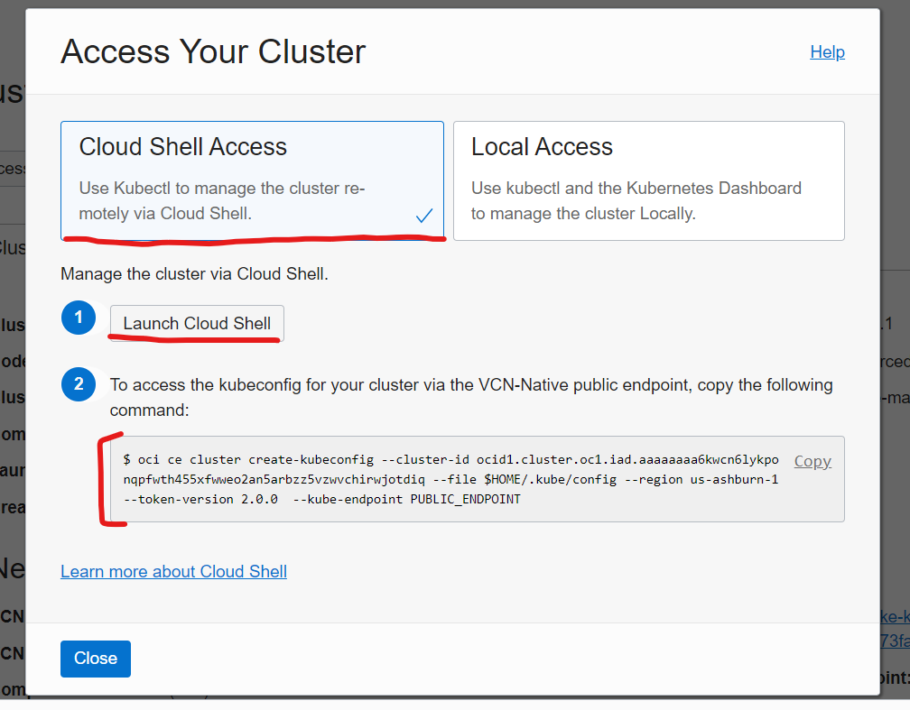

    $ oci ce cluster create-kubeconfig --cluster-id <cluster ocid> --file $HOME/.kube/config --region us-ashburn-1 --token-version 2.0.0  --kube-endpoint PUBLIC_ENDPOINT
    

    
**Crear OCI Setup Configurar**

	$ oci setup config
	
**Dentro de esta configuración se debe definir**

	CAMPO									DONDE ENCONTRAR
	===================================================================================
	- Path (...config [/home/felipe_bas/.oci/config]: ) 			Donde quedará la configuración, dejar por default (~/.oci/config)
	- User OCID								    **Profile -> oracleidentitycloudservice/XXXXX -> OCID -> Copy
	- Tenancy OCID								**Profile -> Tenancy:XXXXX -> OCID -> Copy
	- Region 								      **Seleccionar la región desde las alternativas en base a la que corresponde a cada uno, esquina superior derecha		
	- Do you want to generate a new API Signing RSA key pair? (If you decline you will be asked to supply the path to an existing key.) [Y/n]: **Y Con esto se creará llabe pública de forma automática**
	- Enter a directory for your keys to be created [/var/lib/jenkins/.oci]:    **Enter
	- Enter a name for your key [oci_api_key]:                                  **Enter
	- Public key written to: /var/lib/jenkins/.oci/oci_api_key_public.pem       **Enter
	- Enter a passphrase for your private key (empty for no passphrase):        **Enter
	- Private key written to: /var/lib/jenkins/.oci/oci_api_key.pem             **Enter
	Fingerprint: XX:XX:XX:XX:XX:XX:XX:XX
	Config written to /var/lib/jenkins/.oci/config
	If you haven't already uploaded your API Signing public key through the
	console, follow the instructions on the page linked below in the section
	'How to upload the public key':

**Crear API Key (permite conectar a kubernetes y realizar el despliegue mediante Helm)**

Menu -> Identity & Security -> User -> User Details -> API Key -> Add API Key -> Past Public Key -> Add

	
Pegar la public Key que se creó en paso anterior, para tener esa información ejecutar el siguiente comando y copiar todo el contenido 
	
	$ cat .oci/oci_api_key_public.pem
	

**El fingerprint que se crea debe ser el mismo q está en ~/.oci/config Reemplazar XXX por el dato de cada uno**

	$ fgrep "XXXXXX" ~/.oci/config
	
**Crear Token (Nos permitirá conectarnos con el OCI Registry)**

	Menu -> Identity & Security -> User -> User Details -> Auth Tokens -> Generate Token
	
	
Se puede guardar dentro de un archivo llamado token, **Reemplazar XXXX por el token de cada uno**

	$ echo "XXXXXX" > .oci/token

**Crear registry en OCI y nombraro hello_oke Validar que se cree en compartment OKE**

Menu -> Developer Services -> Container Registry -> Create Repository
	
	
Guardar el nombre del namespace del registry para su futuro uso

	$ echo "XXXXX" > ~/.oci/namespaceRegistry
	
**Crear nuevo repositorio en GitHub, nombrarlo ghithubaction-oke y dejarlo de forma pública**

	Profile -> Your Repositories -> New -> Repository Name -> Create Repository
	
**Una vez creado el nuevo repositorio, ir a la opción "…or import code from another repository" e importar el código de la URL**
	
	https://github.com/whiplash0104/hello-kubernetes.git
	

