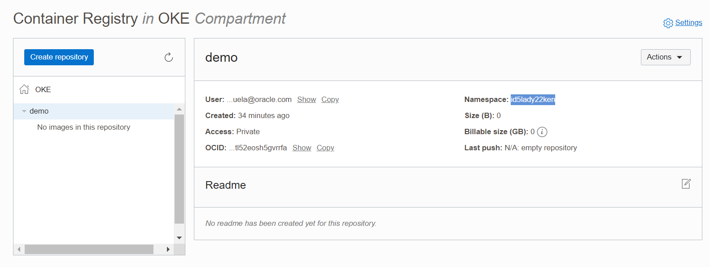

## CI/CD desde Github Actions hacia Oracle OKE

La finalidad de este demo es configurar Github Actions para realizar deploymente de una aplicaicón en Oracle Kubernetes Engine (OKE)


### Requerimientos:

- Cuenta de Oracle Cloud Infrastructure(test gratuito https://www.oracle.com/cloud/free/)
- Cuenta de Github (https://github.com/signup?ref_cta=Sign+up&ref_loc=header+logged+out&ref_page=%2F&source=header-home)

### ¿Qué vamos a hacer?

- Clonar repositorio Github
- Configurar OKE
- Configurar Github Actions
- Despliegue de aplicación
	- Descargar imágen desde dockerhub
	- Crear imágen personalizada de contenedor (compilar)
	- Subirla a OCI registry
	- Instalar app desde Helm
	- Despliegue en Kubernetes
- Modificar aplicación
- Despliegue automático 

### Paso a Paso
0. Crear Compartment
	Menu -> Identity & Security -> Compartmente -> New Compartment
	```
	CAMPO				VALOR
	==============================================
	Name		 		OKE
	Description 			OKE
	Parent Compartment 		chileXX (root)
	```
	
1. Crear cluster OKE, dentro del compartment OKE y **nombrarlo cluster1**
	Menu -> Developer Services -> Kubernetes Clusters (OKE)
	**IMPORTATE: validar que todo se cree en compartment OKE**
	
	
	Create Cluster -> Quick Create 
	

2. Una vez que finalice el proceso, crear kubeconfig
	Click en 
	Acces Cluster -> Cloud Shell Access -> Launch Cloud Shell 
	
	Copiar el comando, similar a **No es el mismo, no copiar este ejemplo**
	
    ```
    $ oci ce cluster create-kubeconfig --cluster-id <cluster ocid> --file $HOME/.kube/config --region us-ashburn-1 --token-version 2.0.0  --kube-endpoint PUBLIC_ENDPOINT
    ```
    
    
3. Crear OCI Setup Configurar
	```
	$ oci setup config
	```
	Dentro de esta configuración se debe definir
	```
	CAMPO									DONDE ENCONTRAR
	===================================================================================
	- Path (...config [/home/felipe_bas/.oci/config]: ) 			Donde quedará la configuración, dejar por default (~/.oci/config)
	- User OCID								Profile -> oracleidentitycloudservice/XXXXX -> OCID -> Copy
	- Tenancy OCID								Profile -> Tenancy:XXXXX -> OCID -> Copy
	- Region 								Seleccionar la región desde las alternativas en base a la que corresponde a cada uno, esquina superior derecha		
	- Para el resto de los campos dejar las opciones por default 
	```
3.1 Para validar, hacer cat al archivo de configuración **Los siguientes datos son un ejemplo** 
	```
	$ cat ~/.oci/config
		[DEFAULT]
		user=ocid1.user.oc1..XXXXXXX
		fingerprint=XX:XX:XX:XX:XX:XX:XX:XX:XX:XX:XX
		key_file=/home/XXXX/.oci/oci_api_key.pem
		tenancy=ocid1.tenancy.oc1..XXXXXXXX
		region=XX-XXXXX-X
	```
	
4. Crear API Key (permite conectar a kubernetes y realizar el despliegue mediante Helm)
	Menu -> Identity & Security -> User -> User Details -> API Key -> Add API Key -> Past Public Key -> Add
	
	Pegar la public Key que se creó en paso anterior, para tener esa información ejecutar el siguiente comando y copiar todo el contenido 
	```
	$ cat .oci/oci_api_key_public.pem
	```
	

4.2 El fingerprint que se crea debe ser el mismo q está en ~/.oci/config **Reemplazar XXX por el dato de cada uno**
	```
	$ fgrep "XXXXXX" ~/.oci/config
	```
	
6. Crear Token (Nos permitirá conectarnos con el OCI Registry)
	Menu -> Identity & Security -> User -> User Details -> Auth Tokens -> Generate Token
	
	Se puede guardar dentro de un archivo llamado token, **Reemplazar XXXX por el token de cada uno**
	```
	$ echo "XXXXXX" > .oci/token
	```
7. Crear registry en OCI y nombraro demo **Validar que se cree en compartment OKE**
	Menu -> Developer Services -> Container Registry -> Create Repository
	
	Guardar el nombre del namespace del registry para su futuro uso
	```
	$ echo "XXXXX" > ~/.oci/namespaceRegistry
	```

8. Crear nuevo repositorio en GitHub, nombrarlo ghithubaction-oke y dejarlo de forma pública
	Profile -> Your Repositories -> New -> Repository Name -> Create Repository
	
8.1 Una vez creado el nuevo repositorio, ir a la opción "…or import code from another repository" e importar el código de la URL 
	```
	https://github.com/whiplash0104/githubaction-OKE.git
	```
	
9. Una vez sincronizado el repositorio, configurar los secrets
	Dentro del repositorio -> Setings -> Secrets -> Actions
	
	```
	CAMPO						DONDE ENCONTRAR
	========================================================================================================================
	OCI_AUTH_TOKEN					cat ~/.oci/token
	OCI_CLI_FINGERPRINT				cat ~/.oci/config		fingerprint= d1:e2:  			
	OCI_CLI_KEY_CONTENT				cat ~/.oci/oci_api_key.pem 		
	OCI_CLI_REGION					cat ~/.oci/config		region=us-ashburn-1
	OCI_CLI_TENANCY					cat ~/.oci/config		tenancy=ocid1.tenancy.oc1.
	OCI_CLI_USER					cat ~/.oci/config		user=ocid1.user.oc1.
	OCI_COMPARTMENT_OCID				Identity & Security > Compartment > $COMPARTMENT_NAME > ocid1.compartment.oc1.
	OCI_DOCKER_REPO					XXX.ocir.io/XXXXXX/demo      done XXX.ocir.io es el key de la región (ej: gru.ocir.io) y XXXX es en namespace del registry, cat ~/.oci/namespaceRegistry
	OKE_CLUSTER_OCID				Developer Services -> OKE -> cluster1 -> ocid1.cluster.oc1 
	```
	

10. Desde la consola (abierta en el punto 2) crear namespace en kubernetes
	```
	$ kubectl create namespace demo
	```
	
11. Crear Secret de tipo docker-registry para el namespace
	Para crear el secret es necesario conocer el identificador del registry (XXX.ocir.io), para ello visitar https://docs.oracle.com/en-us/iaas/Content/General/Concepts/regions.htm y buscar **el key de la región** en la que uno se encuentrá, por ejemplo Sao Paulo gru, Chile scl, Ashbur iad. 
	**en el caso de Ashburn usar iad, en el caso de Sao Paulo gru** 
	**TENANCI_XXXXX es el dato almacenado en ~/.oci/namespaceRegistry**
	**USERNAME_XXXXX es el nombre dle usuario completo, en mi caso oracleidentitycloudservice/felipe.basso@oracle.com**
	**TOKEN_XXXX es ~/.oci/token**
	```
	$ kubectl create secret docker-registry ocirsecret --docker-server=XXX.ocir.io --docker-username='TENANCI_XXXXX/USERNAME_XXXXX' --docker-password='TOKEN_XXXX' -n demo
	```
	**Ejemplo**
	```
	$ kubectl create secret docker-registry ocirsecret --docker-server=iad.ocir.io --docker-username='idgnybveke7a/oracleidentitycloudservice/felipe.basso@oracle.com' --docker-password='tv432_ny!_#1' -n demo
	```

12. Realizar un cambio en nuestro repositorio y esperar que el deploy se realice de forma automática:
	Editar la línea 8 del arhivo githubaction-OKE/chart/demo.yaml y cambiar   **repository: iad.ocir.io/id5lady22ken/demo** por XXX.ocir.io/REGISTRY_NAMESPACE/demo y ver que ocurre

May the force be with you!

12. Validar
	Listar servicios
	```
	$ kubectl get services -n demo
	NAME         TYPE           CLUSTER-IP      EXTERNAL-IP     PORT(S)        AGE
	demo-chart   LoadBalancer   10.96.141.165   129.80.131.252   80:30367/TCP   70s
	```
	Copiar la IP externa en un navegador y enter...

14. Editar la línea 10 del archivo main.py por otro mensaje, nada puede malir sal
	```
	    return {"Hola, ¿cómo estás?"}
	```
