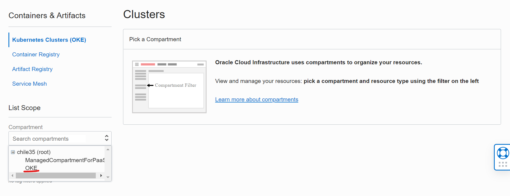
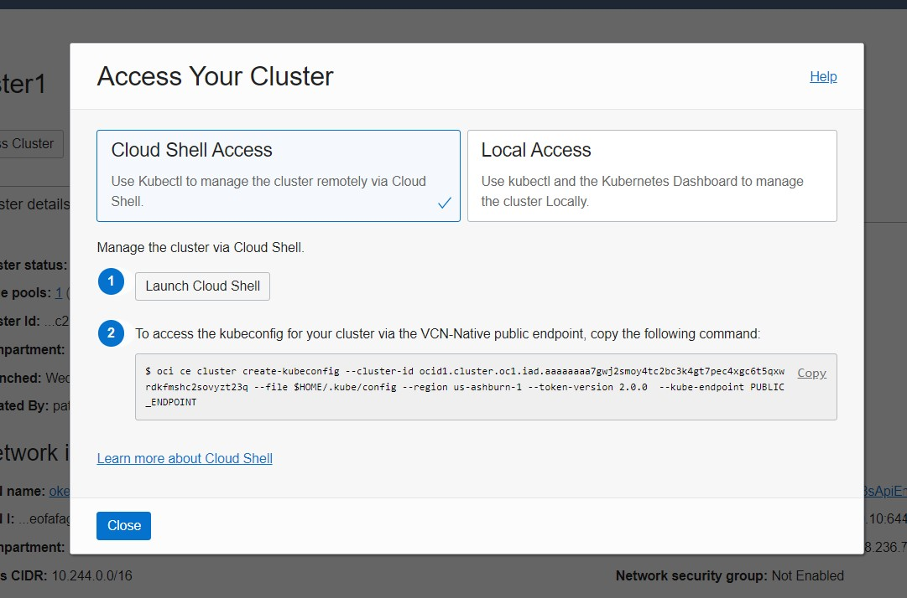
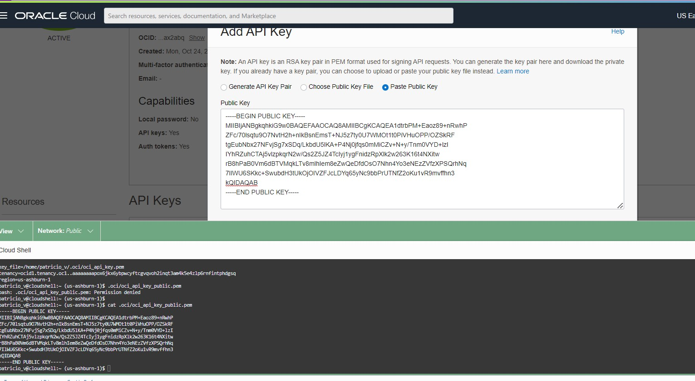
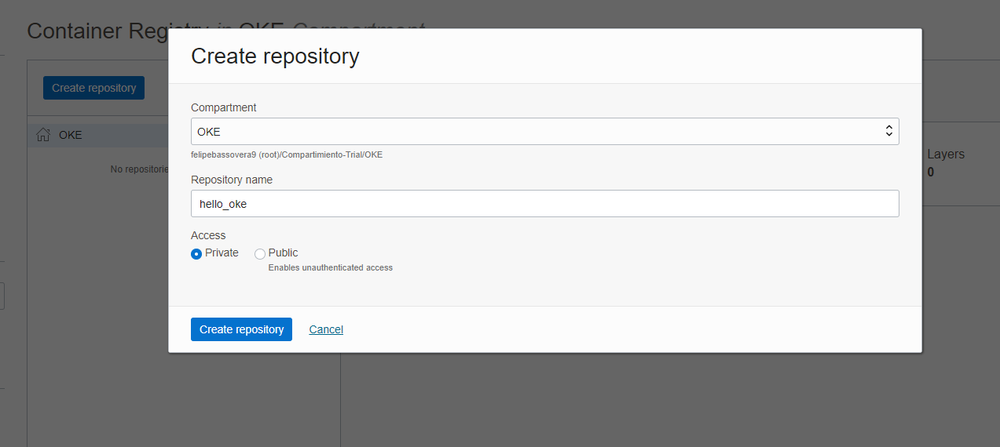

## CI/CD en Oracle Kubernetes Engine Utilizando Jenkins

La finalidad de este demo es configurar Jenkins para realizar deploymente de una aplicaicón en Oracle Kubernetes Engine (OKE)


### Requerimientos:

- Cuenta de Oracle Cloud Infrastructure(test gratuito https://www.oracle.com/cloud/free/)
- Cuenta de Github (https://github.com/signup?ref_cta=Sign+up&ref_loc=header+logged+out&ref_page=%2F&source=header-home)

### Aclaraciones:
- XXXXXX Corresponde a varibale que debe ser modificada en base a la que cada uno posee
- 

### ¿Qué vamos a hacer?

- Instalar/Configurar OKE
- Instalar y Configurar Jenkins
- Instalación Helm
- Clonar repositorio Github
- Despliegue de aplicación
	- Descargar imágen desde dockerhub
	- Crear imágen personalizada de contenedor (compilar)
	- Subirla a OCI registry
	- Instalar app desde Helm
	- Despliegue en Kubernetes
- Modificar aplicación
- Despliegue automático 

### Paso a Paso OKE
0. Crear Compartment
	Menu -> Identity & Security -> Compartmente -> New Compartment
	```
	CAMPO				VALOR
	==============================================
	Name		 		OKE
	Description 			OKE
	Parent Compartment 		XXXX (root)
  
1. Crear cluster OKE, dentro del compartment OKE y **nombrarlo cluster1**
	Menu -> Developer Services -> Kubernetes Clusters (OKE)
	**IMPORTATE: validar que todo se cree en compartment OKE**
	
	
	Create Cluster -> Quick Create 
	

2. Una vez que finalice el proceso, crear kubeconfig
	Click en 
	Acces Cluster -> Cloud Shell Access -> Launch Cloud Shell 
	
	Copiar el comando, similar a **No es el mismo, no copiar este ejemplo**
	
    ```
    $ oci ce cluster create-kubeconfig --cluster-id <cluster ocid> --file $HOME/.kube/config --region us-ashburn-1 --token-version 2.0.0  --kube-endpoint PUBLIC_ENDPOINT
    ```
    
    
3. Crear OCI Setup Configurar
  $ oci setup config
    ```
    Dentro de esta configuración se debe definir
    ```
    CAMPO									DONDE ENCONTRAR
    ===================================================================================
    - Path (...config [/home/felipe_bas/.oci/config]: ) 			Donde quedará la configuración, dejar por default (~/.oci/config)
    - User OCID								    **Profile -> oracleidentitycloudservice/XXXXX -> OCID -> Copy
    - Tenancy OCID								**Profile -> Tenancy:XXXXX -> OCID -> Copy
    - Region 								      **Seleccionar la región desde las alternativas en base a la que corresponde a cada uno, esquina superior derecha		
    - Do you want to generate a new API Signing RSA key pair? (If you decline you will be asked to supply the path to an existing key.) [Y/n]: **Y Con esto se creará llabe pública de forma automática**
    - Enter a directory for your keys to be created [/var/lib/jenkins/.oci]:    **Enter
    - Enter a name for your key [oci_api_key]:                                  **Enter
    - Public key written to: /var/lib/jenkins/.oci/oci_api_key_public.pem       **Enter
    - Enter a passphrase for your private key (empty for no passphrase):        **Enter
    - Private key written to: /var/lib/jenkins/.oci/oci_api_key.pem             **Enter
        Fingerprint: XX:XX:XX:XX:XX:XX:XX:XX
        Config written to /var/lib/jenkins/.oci/config
        If you haven't already uploaded your API Signing public key through the
        console, follow the instructions on the page linked below in the section
      'How to upload the public key':

4. Crear API Key (permite conectar a kubernetes y realizar el despliegue mediante Helm)
	Menu -> Identity & Security -> User -> User Details -> API Key -> Add API Key -> Past Public Key -> Add
	
	Pegar la public Key que se creó en paso anterior, para tener esa información ejecutar el siguiente comando y copiar todo el contenido 
	```
	$ cat .oci/oci_api_key_public.pem
	```
	

4.2 El fingerprint que se crea debe ser el mismo q está en ~/.oci/config **Reemplazar XXX por el dato de cada uno**
	```
	$ fgrep "XXXXXX" ~/.oci/config
	```
	
6. Crear Token (Nos permitirá conectarnos con el OCI Registry)
	Menu -> Identity & Security -> User -> User Details -> Auth Tokens -> Generate Token
	
	Se puede guardar dentro de un archivo llamado token, **Reemplazar XXXX por el token de cada uno**
	```
	$ echo "XXXXXX" > .oci/token
	```
7. Crear registry en OCI y nombraro hello_oke **Validar que se cree en compartment OKE**
	Menu -> Developer Services -> Container Registry -> Create Repository
	
	Guardar el nombre del namespace del registry para su futuro uso
	```
	$ echo "XXXXX" > ~/.oci/namespaceRegistry
	```
8. Crear nuevo repositorio en GitHub, nombrarlo ghithubaction-oke y dejarlo de forma pública
	Profile -> Your Repositories -> New -> Repository Name -> Create Repository
	
8.1 Una vez creado el nuevo repositorio, ir a la opción "…or import code from another repository" e importar el código de la URL 
	```
	https://github.com/whiplash0104/hello-kubernetes.git
	```
